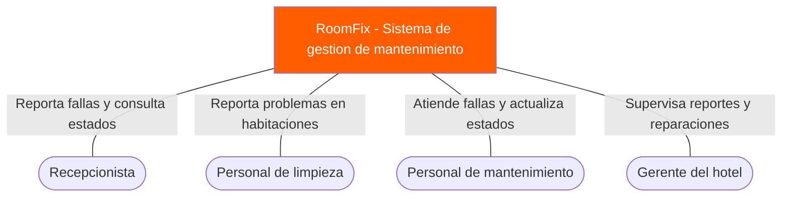
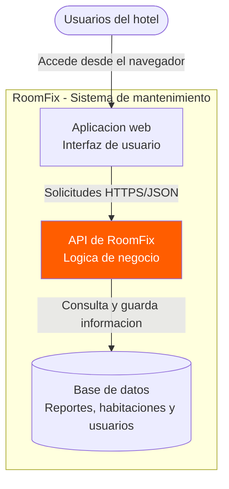
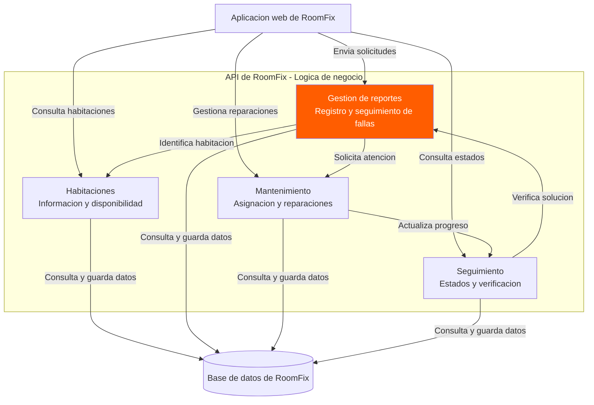

# Diagramas de arquitectura de RoomFix

## 1. Diagrama de contexto (C4 - Nivel 1)

```mermaid
flowchart TB
    sis["RoomFix - Sistema de gestion de mantenimiento"]

    rec([Recepcionista])
    limp([Personal de limpieza])
    mant([Personal de mantenimiento])
    ger([Gerente del hotel])

    sis ---|Reporta fallas y consulta estados| rec
    sis ---|Reporta problemas en habitaciones| limp
    sis ---|Atiende fallas y actualiza estados| mant
    sis ---|Supervisa reportes y reparaciones| ger

    style sis fill:#ff5d00,color:#fff
```

## 2. Diagrama de contenedores (C4 - Nivel 2)

```mermaid
flowchart TB
    usuarios([Usuarios del hotel])

    subgraph sistema["RoomFix - Sistema de mantenimiento"]
        web["Aplicacion web<br/>Interfaz de usuario"]
        api["API de RoomFix<br/>Logica de negocio"]
        db[("Base de datos<br/>Reportes, habitaciones y usuarios")]
    end

    usuarios -->|Accede desde el navegador| web
    web -->|Solicitudes HTTPS/JSON| api
    api -->|Consulta y guarda informacion| db

    style api fill:#ff5d00,color:#fff
```

## 3. Diagrama de componentes (C4 - Nivel 3)

```mermaid
flowchart TB
    web["Aplicacion web de RoomFix"]

    subgraph api["API de RoomFix - Logica de negocio"]
        hab["Habitaciones<br/>Informacion y disponibilidad"]
        rep["Gestion de reportes<br/>Registro y seguimiento de fallas"]
        mant["Mantenimiento<br/>Asignacion y reparaciones"]
        seg["Seguimiento<br/>Estados y verificacion"]
    end

    db[("Base de datos de RoomFix")]

    web -->|Envia solicitudes| rep
    web -->|Consulta habitaciones| hab
    web -->|Gestiona reparaciones| mant
    web -->|Consulta estados| seg

    rep -->|Identifica habitacion| hab
    rep -->|Solicita atencion| mant
    mant -->|Actualiza progreso| seg
    seg -->|Verifica solucion| rep

    hab -->|Consulta y guarda datos| db
    rep -->|Consulta y guarda datos| db
    mant -->|Consulta y guarda datos| db
    seg -->|Consulta y guarda datos| db

    style rep fill:#ff5d00,color:#fff
```
